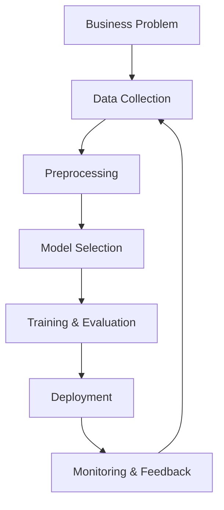
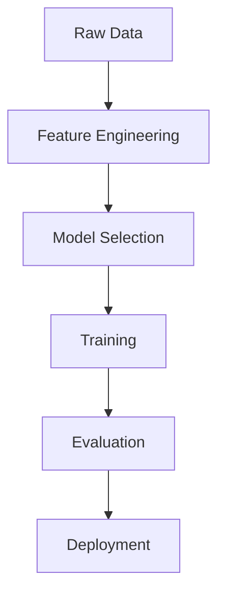
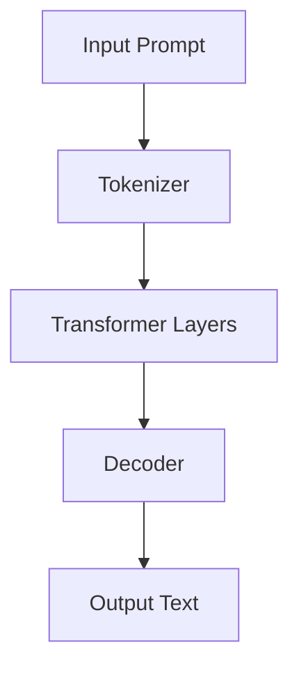
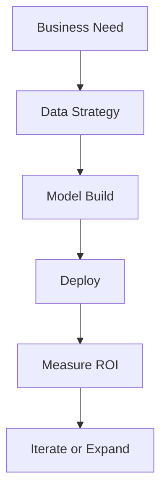

# 📘 AI for Engineering Managers: A Beginner's Booklet

> Your compact guide to understanding and managing AI initiatives effectively.

---

## 📍 Chapter 1: What is AI and Why It Matters to Managers

Artificial Intelligence (AI) refers to the simulation of human intelligence in machines. These machines are designed to think, reason, and make decisions. AI isn't just a buzzword—it's a transformation layer for every business function. As a manager, understanding AI enables you to:

* Evaluate opportunities and risks
* Communicate effectively with technical teams
* Guide product and innovation strategy
* Manage timelines and expectations of AI initiatives

### Key Subfields of AI

* **Machine Learning (ML)**: Learning from data
* **Natural Language Processing (NLP)**: Understanding and generating language
* **Computer Vision**: Understanding images and video
* **Robotics**: Physical interaction and control
* **Reinforcement Learning**: Learning from rewards

### 📈 AI Ecosystem Architecture



---

## 📍 Chapter 2: Machine Learning Demystified

Machine Learning is a subset of AI where algorithms learn from data to make predictions or decisions without being explicitly programmed.

### 🧑‍🧠 Types of Machine Learning

1. **Supervised Learning**

   * Learns from labeled data
   * **Examples**: Spam detection, fraud detection, image classification
   * **Algorithms**: Linear regression, Decision trees, Support Vector Machines, Neural Networks

   #### 📁 Sample: Linear Regression

   ```python
   from sklearn.linear_model import LinearRegression
   from sklearn.model_selection import train_test_split
   from sklearn.datasets import make_regression

   X, y = make_regression(n_samples=100, n_features=1, noise=10)
   X_train, X_test, y_train, y_test = train_test_split(X, y)

   model = LinearRegression()
   model.fit(X_train, y_train)
   print(model.predict(X_test))
   ```

2. **Unsupervised Learning**

   * Finds patterns in unlabeled data
   * **Examples**: Customer segmentation, anomaly detection
   * **Algorithms**: K-means clustering, PCA, DBSCAN

   #### 📁 Sample: K-means Clustering

   ```python
   from sklearn.cluster import KMeans
   from sklearn.datasets import make_blobs
   import matplotlib.pyplot as plt

   X, _ = make_blobs(n_samples=300, centers=4)
   model = KMeans(n_clusters=4)
   model.fit(X)

   plt.scatter(X[:, 0], X[:, 1], c=model.labels_)
   plt.show()
   ```

3. **Semi-supervised Learning**

   * Mix of labeled and unlabeled data
   * **Use Case**: Where data labeling is expensive

   (Typically combines labeled and unlabeled dataset usage in models like self-training.)

4. **Reinforcement Learning (RL)**

   * Agent learns by interacting with an environment and receiving rewards

   #### 📁 Sample: Basic RL using OpenAI Gym

   ```python
   import gym

   env = gym.make("CartPole-v1")
   obs = env.reset()
   for _ in range(1000):
       env.render()
       action = env.action_space.sample()  # Random action
       obs, reward, done, _, _ = env.step(action)
       if done:
           obs = env.reset()
   env.close()
   ```

### 🛠️ When to Use Which

| Problem Type           | Algorithm Type | Example                         |
| ---------------------- | -------------- | ------------------------------- |
| Predicting a number    | Supervised     | Sales forecast                  |
| Grouping similar users | Unsupervised   | Marketing segmentation          |
| Recommendation system  | Hybrid         | Netflix, Amazon suggestions     |
| Strategy learning      | RL             | Self-driving cars, Trading bots |

### 📈 ML Pipeline Architecture



---

## 📍 Chapter 3: Understanding AI Models and LLMs

### 🧠 What are Models?

A model is a mathematical representation of a real-world process. It processes input data and produces an output. Models are trained using datasets to minimize prediction errors.

### ⚙️ LLMs (Large Language Models)

LLMs are models trained on vast amounts of text data to generate human-like language.

* **Examples**: GPT-4 (OpenAI), LLaMA (Meta), Claude (Anthropic), Gemini (Google)
* **Common Use Cases**:

  * Text generation
  * Code completion
  * Chatbots and virtual agents
  * Document summarization

#### 📁 Sample: Text generation using HuggingFace Transformers

```python
from transformers import pipeline

generator = pipeline("text-generation", model="gpt2")
response = generator("AI is transforming the world because", max_length=50)
print(response[0]['generated_text'])
```

### 📚 Types of AI Models

| Model Type                                 | Use Case           | Sample Code                                           |
| ------------------------------------------ | ------------------ | ----------------------------------------------------- |
| Classification (e.g., Logistic Regression) | Spam detection     | `from sklearn.linear_model import LogisticRegression` |
| Regression (e.g., Linear Regression)       | Forecasting prices | See Chapter 2                                         |
| Generative Models (GANs)                   | Image synthesis    | `torch.nn` and PyTorch GAN tutorial                   |
| LLMs (GPT, etc.)                           | Conversational AI  | See HuggingFace sample                                |
| Vision Models (CNNs)                       | Image recognition  | See below                                             |

#### 📁 Sample: Simple CNN with TensorFlow

```python
import tensorflow as tf
from tensorflow.keras import layers

model = tf.keras.Sequential([
    layers.Conv2D(32, (3, 3), activation='relu', input_shape=(28, 28, 1)),
    layers.MaxPooling2D((2, 2)),
    layers.Flatten(),
    layers.Dense(64, activation='relu'),
    layers.Dense(10, activation='softmax')
])
model.compile(optimizer='adam', loss='sparse_categorical_crossentropy', metrics=['accuracy'])
```

### 📈 LLM Architecture Diagram



---

## 📍 Chapter 4: AI Agents and Autonomous Workflows

AI agents are intelligent systems that can perceive their environment and take actions autonomously to achieve goals. They combine perception, planning, and learning.

### 🧠 Examples of AI Agents

* **Customer Service Bots**: Handle queries and escalate issues
* **Sales Enablement Bots**: Auto-generate emails, proposals
* **AI Coding Agents**: Suggest code, fix bugs
* **RPA + AI Agents**: Automate workflows with intelligence

### ⚙️ Agent Architecture

* **Perception** (Input): NLP, Vision
* **Policy/Decision** (Processing): Model inference, RL
* **Action Execution** (Output): APIs, UI automation

### 🧪 Agent Workflow Diagram

```mermaid
graph TD;
    A[User Input] --> B[NLP or Vision Analysis];
    B --> C[Decision Making (LLM, Rule Engine)];
    C --> D[Action (API call, UI step)];
    D --> E[Response to User];
```

### 🧪 Implementing Agents

* Frameworks: LangChain, AutoGPT, MetaGPT
* Skills needed: Prompt engineering, API chaining, tool orchestration
* Infra: Cloud (AWS/GCP), GPUs, vector databases

#### 📁 Sample: Basic Agent with LangChain

```python
from langchain.agents import initialize_agent, load_tools
from langchain.llms import OpenAI

llm = OpenAI(temperature=0)
tools = load_tools(["serpapi", "llm-math"], llm=llm)
agent = initialize_agent(tools, llm, agent="zero-shot-react-description", verbose=True)

agent.run("What is the capital of France plus the square root of 16?")
```

---

## 📍 Chapter 5: Leading AI Projects as a Manager

### ♻️ AI Lifecycle

1. **Problem Definition**
2. **Data Collection & Preparation**
3. **Model Selection & Training**
4. **Evaluation & Tuning**
5. **Deployment**
6. **Monitoring & Improvement**

### 👥 Team Roles

* **ML Engineers**: Build & train models
* **Data Scientists**: Analyze data, prototype models
* **MLOps Engineers**: Automate and scale deployments
* **Product Managers**: Align business and AI goals
* **Ethics/Compliance Leads**: Ensure safe and fair use

### 🧹 What to Watch For

* Data bias and ethics
* Model drift (performance drop over time)
* Feasibility of use cases
* ROI tracking

### 💬 Communication Tips

* Frame AI use cases in business value terms
* Understand the confidence, not just accuracy
* Encourage small pilot projects before scaling

### 📈 AI Project Management Flow



---

## 📍 Chapter 6: Common AI Pitfalls to Avoid as a Manager

Managing AI initiatives comes with unique challenges. Here are common pitfalls and how to avoid them:

### ❌ 1. Jumping in Without a Clear Problem Statement

AI is not a magic wand. Starting without a specific, well-defined problem leads to wasted time and resources.

👌 **Tip**: Always ask, “What business problem are we solving?”

---

### ❌ 2. Overhyping Capabilities

Expecting AI to deliver human-like reasoning or perfection can lead to disappointment.

👌 **Tip**: Set realistic expectations—AI augments humans, it doesn't replace them (yet).

---

### ❌ 3. Ignoring Data Quality

AI models are only as good as the data they’re trained on. Garbage in = garbage out.

👌 **Tip**: Invest time in cleaning and validating your datasets before modeling.

---

### ❌ 4. Lack of Cross-functional Collaboration

Siloed teams lead to mismatches between business needs and technical execution.

👌 **Tip**: Involve stakeholders from product, engineering, data, and compliance early.

---

### ❌ 5. Forgetting About Deployment and Maintenance

Many teams focus solely on building models and neglect deployment, scaling, and monitoring.

👌 **Tip**: Plan for the full AI lifecycle—including MLOps from day one.

---

### ❌ 6. Not Thinking About Ethics and Bias

Ignoring bias or fairness can lead to reputational damage and legal issues.

👌 **Tip**: Include ethics and legal reviews in your project milestones.

---

## 📘 Summary Cheat Sheet

| Topic                      | Summary                                           |
| -------------------------- | ------------------------------------------------- |
| AI vs ML                   | AI is the umbrella, ML is a subset                |
| LLMs                       | Text-generation models trained on massive corpora |
| Agents                     | Autonomous systems with perception & action       |
| Supervised vs Unsupervised | Labeled vs Unlabeled learning                     |
| Manager’s Role             | Vision, prioritization, resource allocation       |

---

## 💚 Final Thought

Being an AI-savvy manager doesn’t mean you have to code—but it does mean you speak the language of data, models, and strategy. Your strength lies in asking the right questions, evaluating the feasibility, and driving value.

Stay curious, experiment often, and empower your teams to build responsibly.
